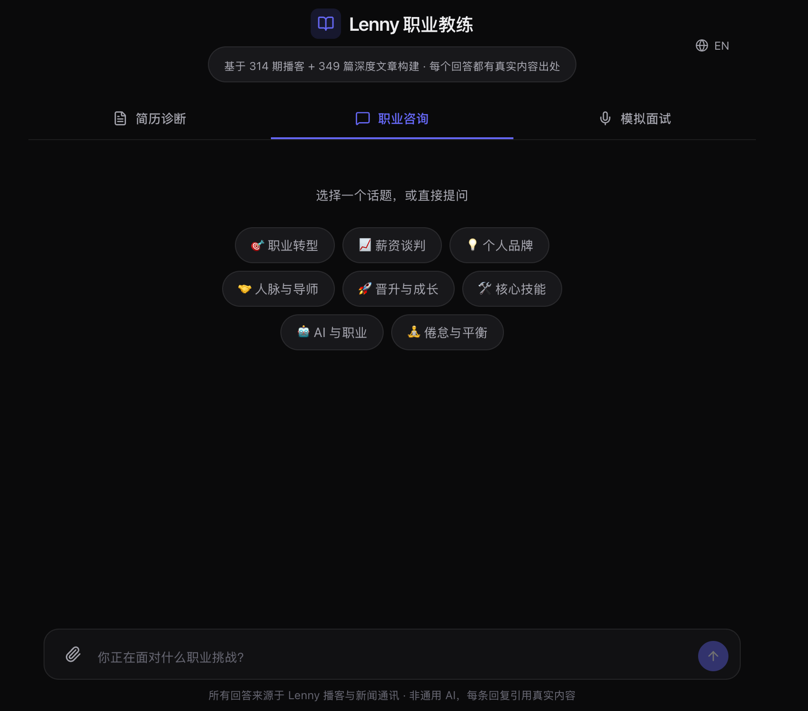

# Lenny Career Coach

A RAG-powered career coaching app built on Lenny Rachitsky's podcast and newsletter content.

[Lenny Rachitsky](https://www.lennysnewsletter.com/) is a former product lead at Airbnb and the author of the #1 business newsletter on Substack. His podcast and newsletter cover product management, growth, career development, and working with executives — featuring guests like Sheryl Sandberg, Brian Chesky, and Julie Zhuo. This app turns that knowledge base into an interactive career coach.

Three coaching modes — **Resume Review**, **Career Advice**, and **Mock Interview** — all grounded in 314 podcast transcripts and 349 newsletter articles. Every response cites its sources with clickable references that open the original content (YouTube embeds for podcasts, rendered articles for newsletters).

Built with Next.js 16, React 19, ChromaDB for vector search, and the GitHub Copilot SDK for LLM inference.



## Features

- **Three coaching modes** — Resume review, career advice, and mock interview, each with a specialized system prompt
- **RAG with inline citations** — Responses include `[REF-XX]` links to original podcast episodes and newsletter articles
- **Reference panel** — Click a citation to see the source: YouTube embeds for podcasts, rendered markdown for newsletters
- **PDF resume upload** — Upload your resume in any coaching mode for personalized feedback
- **Fast vector search** — FastAPI persistent server delivers ~100ms queries (vs ~14s cold subprocess)
- **Bilingual UI** — English and Chinese with a one-click language switcher
- **Hot-swappable model** — Change the LLM model in config, takes effect on the next request

## Prerequisites

- **Node.js 18+** and npm
- **Python 3.8+**
- **GitHub account with a Copilot subscription** — The app uses the [GitHub Copilot SDK](https://github.com/nicolo-ribaudo/github-copilot-sdk) for LLM access. This requires an active [GitHub Copilot](https://github.com/features/copilot) subscription (paid).
- **`gh` CLI** — Install from [cli.github.com](https://cli.github.com/), then run `gh auth login`

## Quick Start

```bash
# 1. Clone the repo
git clone https://github.com/washi4/lenny-career-coach.git
cd lenny-career-coach

# 2. Install Node dependencies
npm install

# 3. Install Python dependencies (first run downloads ~2GB of model weights)
pip install -r requirements.txt

# 4. Build the ChromaDB vector index (processes 663 files, takes 10-30 min)
python3 scripts/build_index.py --config knowledge-coach-config.json --rebuild

# 5. Authenticate with GitHub
gh auth login
gh auth status  # Verify: should show "Logged in to github.com"

# 6. Start both servers (two separate terminals)

# Terminal 1 — Search server (FastAPI, port 8001)
npm run search-server

# Terminal 2 — Next.js dev server (port 3000)
npm run dev
```

Open [http://localhost:3000](http://localhost:3000).

## Authentication

The app authenticates via `gh` CLI OAuth tokens — **not** personal access tokens (PATs).

1. Install the `gh` CLI: [cli.github.com](https://cli.github.com/)
2. Log in: `gh auth login` (follow the browser-based OAuth flow)
3. Verify: `gh auth status` should show `Logged in to github.com`

Your GitHub account must have an active Copilot subscription. The SDK reads the OAuth token from `gh` automatically — no API keys or environment variables needed.

## Architecture

```
User → Next.js API (/api/chat) → Copilot SDK → LLM
                                       ↓
                                 search_knowledge_base tool
                                       ↓
                          FastAPI server (port 8001)
                          or subprocess fallback (port N/A)
                                       ↓
                            ChromaDB vector search
                                       ↓
                      Top-K results with metadata → LLM generates
                      response with [REF-XX] inline citations
```

The search has a **dual-path** strategy: it tries the FastAPI server first (~100ms warm), and falls back to spawning a Python subprocess (~14s) if the server is unavailable. Both paths query the same ChromaDB index.

## Configuration

Edit `knowledge-coach-config.json`:

```json
{
  "name": "Lenny Career Coach",
  "model": "claude-sonnet-4.6",
  "knowledge_base_dir": "./data",
  "chroma_dir": "./data/.chroma",
  "embedding_model": "all-MiniLM-L6-v2",
  "top_k": 5
}
```

| Field | Description |
|-------|-------------|
| `model` | LLM model ID. Change takes effect on the next chat request — no restart needed. |
| `top_k` | Number of search results returned per query. |
| `chroma_dir` | Path to ChromaDB storage. Gitignored; rebuilt locally via `build_index.py`. |
| `embedding_model` | Sentence-transformers model for embeddings. Must match what was used to build the index. |

## Project Structure

```
lenny-career-coach/
├── src/
│   ├── app/
│   │   ├── page.tsx                # Main page — 3 tabs, split-panel layout
│   │   ├── globals.css             # Theme tokens (Tailwind v4)
│   │   └── api/
│   │       ├── chat/route.ts       # LLM chat + search tool + SSE streaming
│   │       ├── parse-pdf/route.ts  # PDF text extraction
│   │       └── reference/[file]/route.ts  # Serve source content
│   ├── components/                 # React components
│   ├── lib/
│   │   ├── i18n.ts                # Internationalization (EN/ZH)
│   │   ├── chat-client.ts         # SSE streaming client
│   │   └── career-data.ts         # Tab config, topic definitions
│   └── types/index.ts
├── scripts/
│   ├── search_server.py           # FastAPI persistent search server
│   ├── search.py                  # CLI search + subprocess fallback
│   ├── build_index.py             # Build ChromaDB vector index
│   └── config.py                  # Shared config loader
├── data/
│   ├── podcasts/                  # 314 podcast transcripts (.md)
│   ├── newsletters/               # 349 newsletter articles (.md)
│   └── .chroma/                   # ChromaDB index (gitignored, rebuilt locally)
├── .agents/skills/                # Coaching skill definitions (system prompts)
├── knowledge-coach-config.json    # Runtime config
└── AGENTS.md                      # AI agent instructions for contributors
```

## Troubleshooting

**Search takes 14+ seconds**
The FastAPI search server isn't running. Start it with `npm run search-server`. You should see `ChromaDB ready: 45463 chunks` in the output.

**"Model not found" or authentication errors**
Run `gh auth status`. Your GitHub account needs an active Copilot subscription. If you see "not logged in", run `gh auth login`.

**ChromaDB errors on startup**
The vector index hasn't been built yet. Run:
```bash
python3 scripts/build_index.py --config knowledge-coach-config.json --rebuild
```

**`sentence-transformers` download is slow**
First run downloads ~2GB of PyTorch + model weights. This is expected. Subsequent runs use the cached model.

**"Cannot find module" errors**
Run `npm install` to install Node dependencies.


## Data Source & Attribution

The knowledge base content is sourced from [Lenny Rachitsky's](https://www.lennysnewsletter.com/) podcast and newsletter, via the [joeseesun/lennys-podcast-newsletter](https://github.com/joeseesun/lennys-podcast-newsletter) data collection.

> **Disclaimer**: This project is **not** affiliated with or endorsed by Lenny Rachitsky. It is intended for personal learning and research purposes.

## License

[MIT](LICENSE)

## Acknowledgments

- [Lenny Rachitsky](https://www.lennysnewsletter.com/) — for the podcast and newsletter content that powers this app
- [joeseesun/lennys-podcast-newsletter](https://github.com/joeseesun/lennys-podcast-newsletter) — for the curated data collection
- [GitHub Copilot SDK](https://github.com/nicolo-ribaudo/github-copilot-sdk) — for LLM integration
- [ChromaDB](https://www.trychroma.com/) — for vector search
- [YouMind Lenny Career Coach](https://youmind.com/zh-CN/landing/lenny-career-coach) — for the original inspiration
